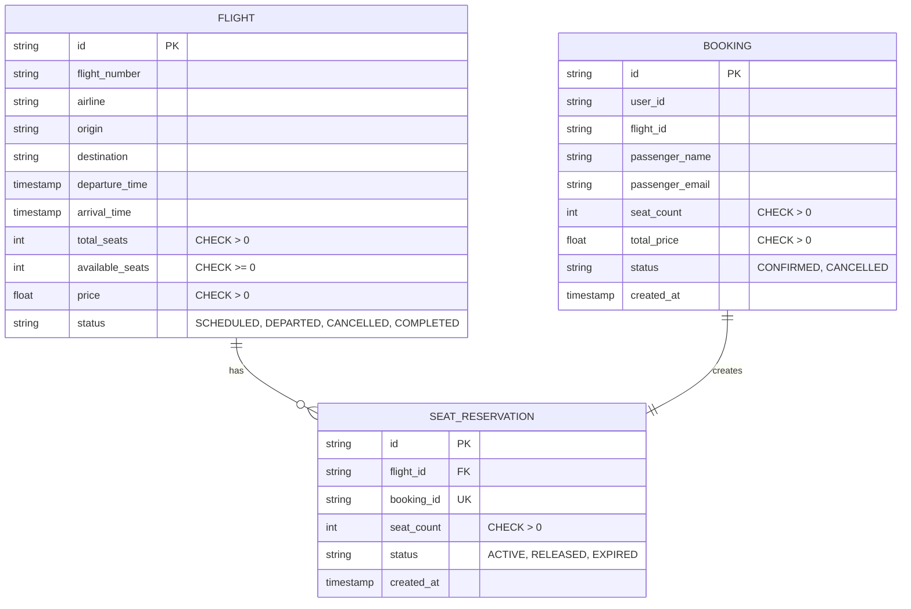

# ER Diagram (3NF)

```mermaid
erDiagram
    FLIGHT ||--o{ SEAT_RESERVATION : has
    BOOKING ||--|| SEAT_RESERVATION : creates

    FLIGHT {
        string id PK
        string flight_number
        string airline
        string origin
        string destination
        timestamp departure_time
        timestamp arrival_time
        int total_seats "CHECK > 0"
        int available_seats "CHECK >= 0"
        float price "CHECK > 0"
        string status "SCHEDULED, DEPARTED, CANCELLED, COMPLETED"
    }

    SEAT_RESERVATION {
        string id PK
        string flight_id FK
        string booking_id UK
        int seat_count "CHECK > 0"
        string status "ACTIVE, RELEASED, EXPIRED"
        timestamp created_at
    }

    BOOKING {
        string id PK
        string user_id
        string flight_id
        string passenger_name
        string passenger_email
        int seat_count "CHECK > 0"
        float total_price "CHECK > 0"
        string status "CONFIRMED, CANCELLED"
        timestamp created_at
    }
```

## Constraints
- available_seats >= 0
- total_seats > 0, price > 0
- One booking → exactly one reservation
- Unique (flight_number + departure date)
