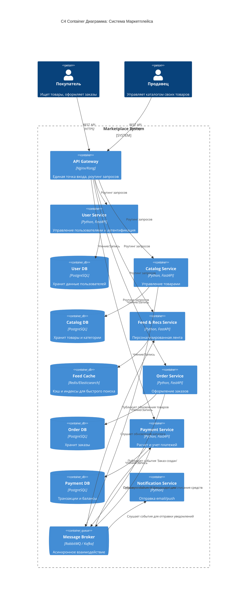

# Архитектура Маркетплейса (C4 + Service Initialization)

## 1. C4 Container Диаграмма



## 2. Домены и распределение по сервисам

Логика разбиения простая — каждый домен отвечает за свою изолированную часть бизнеса и живет в своем микросервисе:
*   **Управление пользователями (User Service):** Регистрация, профили, авторизация покупателей и продавцов.
*   **Управление каталогом (Catalog Service):** Зона ответственности продавцов. Добавление товаров, изменение цен, остатков.
*   **Управление заказами (Order Service):** Создание заказа, отслеживание статуса (в сборке, в пути, доставлен).
*   **Персонализированная выдача (Feed Service):** Генерация ленты рекомендаций и быстрый поиск для покупателя.
*   **Учет платежей (Payment Service):** Обработка транзакций, списание денег, расчеты с продавцами.
*   **Уведомления (Notification Service):** Отправка писем и пушей по статусам заказов.

## 3. Границы владения данными и взаимодействие

В системе используется паттерн **Database-per-service**. 
*   Никаких общих баз. Каждый сервис имеет свою БД и полностью ей владеет.
*   Например, `Order Service` не может напрямую сделать SELECT из таблицы пользователей. Если ему нужны данные юзера, он запрашивает их у `User Service`.

**Способы взаимодействия:**
1.  **Синхронное (REST API):** Используется для запросов клиентов через API Gateway (например, получить корзину или профиль).
2.  **Асинхронное (Message Broker - RabbitMQ/Kafka):** Основной способ общения между сервисами. *Пример:* `Order Service` сохраняет заказ у себя в базе и кидает событие `OrderCreated` в брокер. `Payment Service` ловит это событие и списывает деньги, а `Notification Service` отправляет письмо.

## 4. Альтернативные варианты декомпозиции

**Вариант А: Монолитная архитектура (Модульный монолит)**
Всё пишется в одном приложении. База данных одна, но код разделен по папкам.

**Вариант Б: Сервис-ориентированная архитектура (SOA) с общей БД**
Код разбит на независимые сервисы, как у нас, но все они ходят в одну огромную базу данных (Shared Database).

## 5. Trade-off'ы вариантов

*   **Монолит (Вариант А):**
    *   *Плюсы:* Легко стартовать, всё в одном репозитории, не нужно возиться с брокерами сообщений и распределенными транзакциями.
    *   *Минусы:* Лента товаров (Feed) и Оплаты (Payments) требуют разных ресурсов. При наплыве пользователей на распродаже монолит упадет целиком, и перестанут работать даже независимые функции.
*   **SOA с общей БД (Вариант Б):**
    *   *Плюсы:* Нет проблем с консистентностью данных (можно просто делать JOIN таблиц из разных доменов).
    *   *Минусы:* База данных становится узким горлышком и единой точкой отказа. Если кто-то "криво" обновит таблицу каталога, могут сломаться заказы.

## 6. Обоснование финального выбора

Выбрана **Микросервисная архитектура с асинхронным взаимодействием**. 
*Почему:* Маркетплейс — это система с неравномерной нагрузкой. `Feed Service` (выдачу товаров) будут дергать постоянно тысячами RPS, поэтому там нужен быстрый кэш (например, Redis). `Payment Service` дергают реже, но там важна строгая надежность транзакций (PostgreSQL). Разделение на микросервисы позволяет масштабировать только те части, которые реально нагружены, и не ронять всю платформу из-за ошибки в одном модуле. Да, инфраструктура становится сложнее (нужен брокер, CI/CD), но это оправдано требованиями к стабильности маркетплейса.

## 7. Инструкция по запуску (Health-check)

В рамках ДЗ реализован базовый каркас одного из сервисов (User Service) для проверки инфраструктуры.

1. Убедитесь, что у вас установлен Docker и docker-compose.
2. Находясь в корне проекта (где лежит файл `docker-compose.yml`), выполните команду:
   ```bash
   docker-compose up -d --build